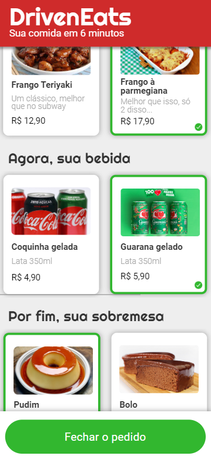

# <p align = "center">Web Mobile DrivenEats</p>

<p align = "center"></p>

## ✏️ Description
<p align="justify" >This project was done in the third week of the Full Stack Driven course. An average of 15 hours were put into the website, the main goals were to train javascript web. The website is not responsive to larger screens, it is intended to work only on cellphones, since the main goal was to train JavaScript logic. I recommend using the Iphone XR setup.</p>

##  <p align = "left"> :white_circle: Technologies</p>

- [JavaScript](https://www.javascript.com/)
- [HTML5](https://html5.org/)
- [CSS3](https://www.w3.org/Style/CSS/)

# 🏁 Let's go!

First clone this github repository into your computer, then open the folder cloned:

```bash
git clone https://github.com/ecocaval/DrivenEats.git
```
Open the index.html file in your default browser and enjoy the website!
